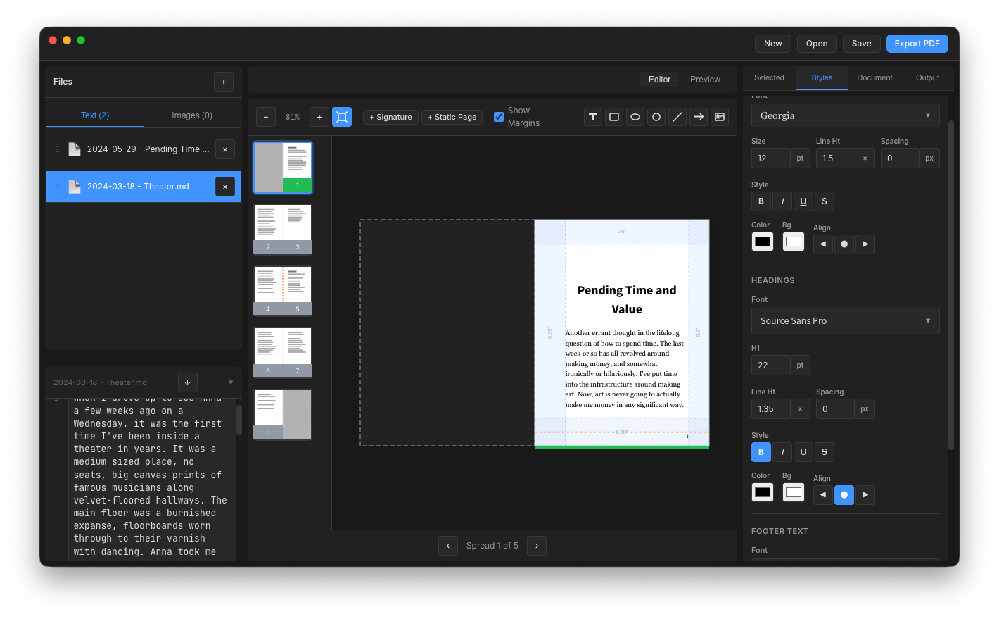

# PrintFold

Create printable, signature-based booklets from markdown documents — for
**macOS** and **iPadOS**.



This is a Rust + [Tauri 2](https://tauri.app) port of
[laffan/printfold](https://github.com/laffan/printfold). It has the same
features and reads and writes the same `.printfold` project files; the
layout engine, project format and PDF writer are native Rust, and the
editor UI runs in the system WebView. See [docs/parity.md](docs/parity.md)
for the feature-by-feature comparison.

## Getting Started

On launch, PrintFold shows a welcome screen with **New Project**,
**Open Project**, and a list of recent projects. A project must be
created or opened before the editor opens — every change is then
auto-saved to that file.

Projects are stored as `.printfold` files (a ZIP archive with a custom
extension). Switch projects at any time via the **Projects…** button in
the header (or File › Projects…, ⌘⇧O).

- **macOS**: PrintFold registers itself as the owner of `.printfold`
  files, so double-clicking one in Finder opens it.
- **iPadOS**: projects live in *Files › On My iPad › PrintFold*; exports
  are offered through the system Save to Files sheet. Touch, Pencil,
  pinch zoom and press-and-hold menus are supported. See
  [docs/ipados.md](docs/ipados.md).

## Building

Requirements: Rust (stable), Node.js 20+, Xcode (command-line tools for
macOS; full Xcode for iPadOS).

```bash
npm install
npm run tauri:dev       # run on macOS with a live-reloading UI
npm run tauri:build     # PrintFold.app and .dmg in target/release/bundle

rustup target add aarch64-apple-ios aarch64-apple-ios-sim
npm run ios:init        # once, generates the Xcode project
npm run ios:dev         # simulator or device
```

Tests: `cargo test --workspace` (engine and app), `npm run typecheck`,
and an end-to-end WebDriver run on Linux (`e2e/run_e2e.py`).

## Documentation

Technical documentation starts at [docs/README.md](docs/README.md).

## License

MIT
